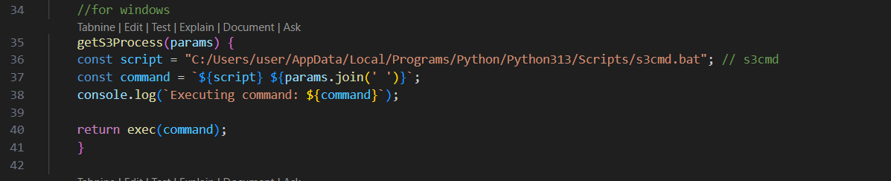

# Streaming Platform

## 介紹

- 一個簡易的串流平台，並且利用 amazon s3 作為資料存儲
- <a href='https://hackmd.io/8TjXmO6ZQiWGy4wULmGyog'>詳細介紹</a>

## 架構

- <a href='https://hackmd.io/8r00f8XbQKu0VzChQ0sWsQ?view'>詳細介紹</a>

## Prerequisite

- s3cmd : `apt install s3cmd`

## Usage

- `s3cmd --configure`
- `cd backend && npm install`
- `cd backend && node index.js`

**windows**

- 要將 s3cmd.js 的 script 改成自己的 s3cmd 的位置
